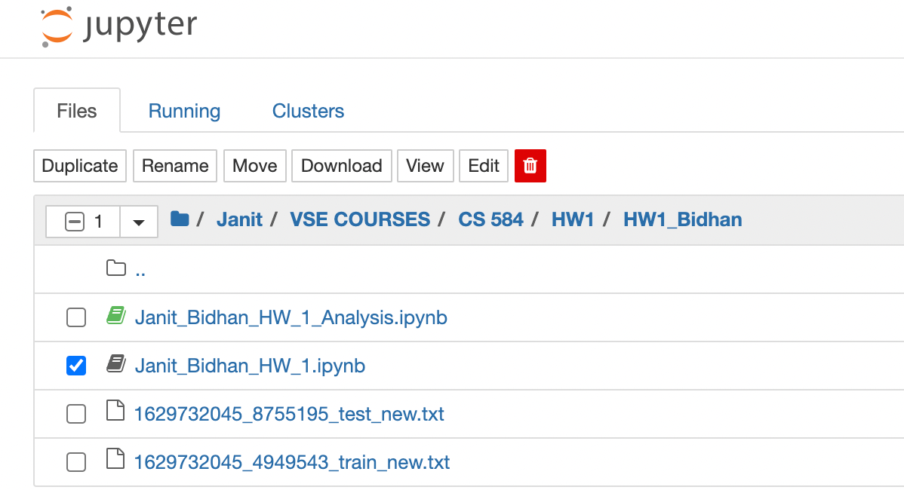

# Moview Review Classification (Text Classification)

Movie Reviews describe the movies and the reactions from the fans and critics. The text has certain characteristics, sentiments and emotions of the users. 

> We need to Develop a K-nearest-Neighbor algorithm that can determine, a particular Movie Review is either positive review or negative review i.e. +1 or -1 

The training dataset consists of 25000 records and the test dataset consists of 25000 records.

### Pseudocode

1. Preprocess the data and minimize the verbose
2. Split the training data into k fold to perform the cross-validation
3. Implement the k-nearest neighbor classifier using various distance finder algorithms
4. Predict the labels, find accuracy and tune the classifier 
5. On the Testing data set run the classifier and obtain the predicted labels.

#How to Run the code
The code here is to be run in Jupiter Notebook
## Installation
[Installing Jupyter Notebook](https://test-jupyter.readthedocs.io/en/latest/install.html)

## Running Jupyter Notebook
```bash
jupyter notebook
```
## Usage
Go to the folder in the Jupyter


> There are 2 IPYNB files i.e a notebook document created in Jupyter Notebook.
> 
>For Analysing of the algorithm and various other parameters
> >Janit_Bidhan_HW_1_Analysis.ipynb 
> >>KNN implementation: k_nearest_neighbors_Training(....)
> 
> For actual prediction of labels for the test file
> >Janit_Bidhan_HW_1.ipynb 
> >>KNN implementation: k_nearest_neighbors(....)
> 
> Both Files contain a custom implementation of KNN algorithm. The name of the functions are provided after each file

> ####Change the input data file path or add the files to the same folder for testing i.e. Training and Test Data files Paths

```python
# Reading training Data in the Janit_Bidhan_HW_1_Analysis.ipynb
trainingData = readTrainfile("1629732045_4949543_train_new.txt")
    
# Reading data files in the Janit_Bidhan_HW_1.ipynb 

# Reading training Data
trainingData = readTrainfile("1629732045_4949543_train_new.txt")
#Reading Test File
testData = readtestfile("1629732045_8755195_test_new.txt")
```
